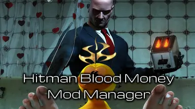

	

BloodMoneyModMan 
------------

## A Work-In-Progress Mod Manager for Hitman Blood Money.
Welcome and thank you for checking out Hitman Blood Money Mod Manager (HBMMM)

This is a beta release of the mod manager, some features may be broken or incomplete.
See Documentation and Examples for examples on how to use this mod manager.
------------
* This program injects and replaces files nested within game Scenes archives (.zip files) as well as handles manually placed files which should get placed in the main games directory. It adheres to a strict structure of /Scenes/{Mission}{mission_type).zip/Scenes/{mission}{mission_type).{extension} with the exception of Hideout, and HitmanBloodMoney.zip and saveandcontinue.zip, which are one directory above.

### Any other files not properly labeled in mod.txt or named appropriately will be simply placed in the game's main directory

# Contact Information
You may feel free to contact me at any time through any of my available means, either here on our issue tracker, the NexusMods page, or the project Discord for tips, suggestions or inquiries.

 

 

